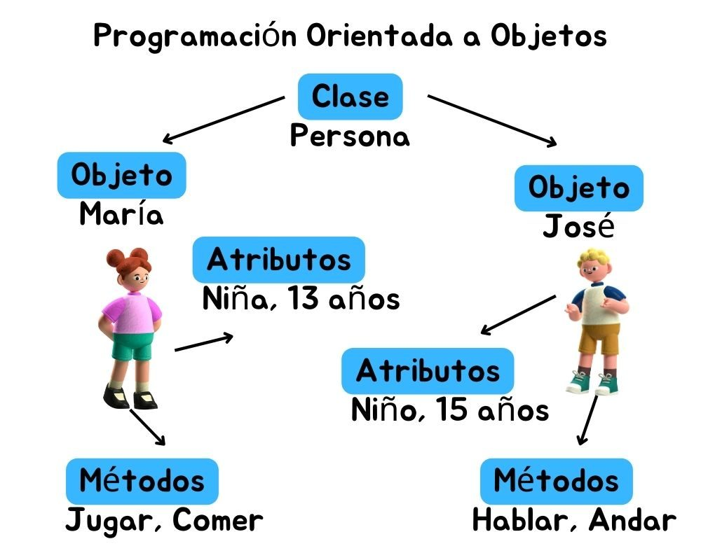

# Conocimientos sobre JavaScript

## 1. ¿Qué tipo de bucles hay en JS?

Para explicar los tipos de bucles que existen en JS, primero vamos a ver una pequeña definición sobre que es un bucle y así mismo intentaremos realizar un ejemplo para todos los tipos de bucles para ver la diferencia de cada uno.

Los bucles (_loops_) normalmente son utilizados para realizar tareas repetitivas con base en una condición. Estas condiciones típicamente devuelven true (_verdadero_) o false (_falso_) al ser evaluados.

### En JavaScript los tres tipos de bucles más comunes son:

* **For**

Los bucles **For** son comúnmente utilizados para contar un cierto número de iteraciones para repetir una sentencia. Puedes utilizar una sentencia break para salir del bucle antes que la expresión de condición devuelva _false_.

Existen tres clases de bucles **for**, que se describen a continuación:

* **For tradicional**.

_**Sintaxis**_

```javascript
for ([initializacion]); [condicion]; [expresion-final]) {
// sentencias
}
```


La sentencia for en javascript consiste de tres expresiones y una declaración

**Descripción**:

* **Inicialización** - Sucede antes de la primera ejecución del _bucle_. Esta expresión es comúnmente utilizada para crear contadores. Las variables creadas tienen un alcance (_scope_) limitado al cuerpo del _bucle_. Una vez que el bucle ha terminado su ejecución las variables son destruidas.
* **Condición** - Expresión que es evaluada antes de la ejecución de cada iteración. Si se omite, esta expresión es evaluada como _verdadera_. Si devuelve true, la sentencia del cuerpo del _bucle_ se ejecuta. Si devuelve _false_, el _bucle_ se detiene.
* **Expresión-final** - Expresión que se ejecuta luego de cada iteración. Usualmente es utilizada para incrementar un contador. Pero también puede ser utilizada para decrementar el contador.

<mark style="color:blue;">Ejemplo:</mark>

```javascript
var frutas =['fresa','pera','manzana','uva','babano'];
for(var i = 0; i< frutas.length; i++){
    console.log(frutas[i]);
}
```

La salida será:

```javascript
"fresa"
"pera"
"manzana"
"uva"
"babano"
```

<mark style="color:orange;">Explicación:</mark>

La longitud de las frutas serán 5, recorreremos todo el array hasta que “`i`”, que empieza en `0` sea `>=` que la longitud de las frutas. Mientras “`i`” sea `<` que la longitud de las frutas continuaremos, cada que incremente en `1` llegará a `5` y saldrá del bucle.

* **For…in**

La declaración **for...in** itera sobre las propiedades enumerables de un _objeto_, en orden arbitrario. Para cada propiedad distinta, se pueden ejecutar sentencias.

_**Sintaxis**_

```javascript
for (variable in object) {
...
}
```

**Descripción**

* **variable**: Un nombre distinto es asignado a la variable en cada iteración.
* **object**: Objeto cuyas propiedades enumerables (no de tipo symbol) son iteradas.

<mark style="color:blue;">Ejemplo:</mark>

<pre class="language-javascript"><code class="lang-javascript">var frutas =['fresa','pera','manzana','uva','babano'];
for(fruta in frutas){
<strong>    console.log(fruta);
</strong>    console.log(frutas[fruta]);
}
</code></pre>

La salida será: los números hacen referencia al índice de cada elemento del objeto

```javascript
"0"
"fresa"
"1"
"pera"
"2"
"manzana"
"3"
"uva"
"4"
"babano"
```

<mark style="color:orange;">Explicación:</mark>

Para este bucle, no se ponen condiciones ni incrementadores, **For-in** recorre el bucle cuantas veces sea necesario de acuerdo al número de elementos que están dentro de la colección. Es importante tener en cuenta que la “`fruta`” no representa el “`valor`” sino el “`indice`”

* **For…Each**

El método **forEach()** ejecuta la función indicada una vez por cada elemento del array.

_**Sintaxis**_

```javascript
array.forEach(function(valorAcual, indice, arr), thisValue)
```

**Descripcion**:

* **function()** (Obligatorio).Una función que se ejecuta para cada elemento del array.
* **valorActual** (Obligatorio). El valor del elemento actual.
* **index** (Opcional). El índice del elemento actual.
* **arr** (Opcional). El array del elemento actual.
* **thisValue** (Opcional). El valor predeterminado es indefinido. Un valor pasado a la función como su valor _**this**_.

<mark style="color:blue;">Ejemplo:</mark>

```javascript
var frutas =['fresa','pera','manzana','uva','babano'];
frutas.forEach(function(element){
    console.log(element);
});
```

La salida seria:

```javascript
"fresa"
"pera"
"manzana"
"uva"
"babano"
```

<mark style="color:orange;">Explicación:</mark>

Al realizar al llamado al método **forEach()** directamente sobre el _array_, le estamos diciendo a JavaScript que queremos que por cada uno de los elementos dentro del array realice una operación, para este caso la operación es hacer un console.log de cada elemento.

* **While**

El bucle **while** empieza por evaluar la condición. Si la condición es verdadera (devuelve _true_), entonces las sentencias son ejecutadas. Si la condición es falsa (devuelve _false_), entonces las sentencias no son ejecutadas. Luego el _bucle_ finaliza

**Sintaxis**

```javascript
while (condicion){
    sentencia(s);
}
```

<mark style="color:orange;">Explicación:</mark>

* **sentencia**(s): Una sentencia es código que se ejecuta si la condición devuelve verdadero ( `true` ).
* **condición**: Es una expresión booleana (_Boolean_) que es evaluada antes de cada paso (_iteración_) por el _bucle_. Si esta condición evalúa a verdadero ( `true` ), las sentencias son ejecutadas. Cuando la condición evalúa a falso ( `false` ), la ejecución continúa con la siguiente sentencia luego del bucle _while_.

<mark style="color:blue;">Ejemplo:</mark>

<pre class="language-javascript"><code class="lang-javascript">var frutas =['fresa','pera','manzana','uva','babano'];
var i = 0;
while(i &#x3C; frutas.length){
    console.log(frutas[i]);
<strong>    i++;
</strong>}
</code></pre>

La salida seria:

```javascript
"fresa"
"pera"
"manzana"
"uva"
"babano"
```

<mark style="color:orange;">Explicación:</mark>

Se declara la variable `i = 0`, el _while_ evalúa la condición que indica que: mientras que el `i` sea `<` que la longitud de las frutas, va a entrar a realizar alguna operación, para este caso imprimir cada elemento, después de imprimir el elemento de la colección, se incremente el valor de “`i`” en `1` y se vuelve a evaluar la condición hasta que se cumpla.

* **Do while**

El bucle _do...while_ está cercanamente relacionado al _bucle_ while . En el bucle _do...while_ , la condición se evalúa al final, por este motivo los bucles _Do...While_ aseguran que el código se ejecute por lo menos una vez, y luego de esta primera ejecución, si la condición dentro del _while()_ es true, continúa con el _bucle_, de otra forma, se detiene.

#### _**Sintaxis**_

```javascript
do {
    sentencias;
} while (condicion);
```

* **sentencia**(s): Una sentencia es ejecutada por lo menos una vez antes de que la condición o expresión booleana sea evaluada y es re-ejecutada cada vez que la condición devuelve _true_.
* **condición**: Aquí la condición es una expresión booleana. Si la expresión booleana evalúa a true, las sentencias son ejecutadas de nuevo. Cuando la expresión booleana devuelve _false_, el bucle finaliza.

<mark style="color:blue;">Ejemplo:</mark>

```javascript
var frutas =['fresa','pera','manzana','uva','babano'];
var i = 0;
do{
    console.log(frutas[i]);
    i++;
} while(i < frutas.length);
```

La salida seria:

```javascript
"fresa"
"pera"
"manzana"
"uva"
"babano"
```

### Mejores prácticas&#x20;

1. Elegir el tipo de bucle adecuado, por ejemplo: si conoces el numero de iteraciones o necesitas un control preciso sobre el contador puedes usar el bucle FOR
2. Puedes usar WHILE cuando la condicion de salida no es fija o depende de eventos internos
3. FOR..IN cuando quieras iterar sobre las propiedades enumerables de un objeto
4. Evtar usar bucles infinitos
5. Mantener un codigo claro y preciso.

## 2. ¿Cuáles son las diferencias entre const, let y var?

Desde su aparición el lenguaje de JavaScript ha empleado el termino `var` para crear una variable conociéndose esta como una variable global, pero que puede generar algunos problemas con otras variables al no ser tan especifica, y es aquí donde aparece el termino `let`, que es otra manera de definir una variable un poco más específica y que solo estará disponible en la función donde se encuentra. Si queremos una mayor especificad podemos utilizar el término `const` que resulta se run a forma mucho más especifica a la hora de declarar variables.

JavaScript es lo que se conoce como un lenguaje dinámico, eso quiere decir (entre otras cosas) que las variables se crean conforme el programa se ejecuta y el tipo de dato de la variable es almacenada en el valor y no en la variable como tal, por lo tanto, puedes crear variables que almacenen diferentes tipos de datos sin tener que declararlos de alguna forma en especial como en otros lenguajes tales como Java o C.

<mark style="color:blue;">Ejemplo:</mark>

```javascript
const nombre = 'Marcela';
var edad = 35;
if(nombre === 'Marcela'){
    let edad = 32;
    console.log('La edad de', nombre, 'es: ', edad);
}
console.log('La edad requerida es: ', edad);
```

<mark style="color:orange;">Explicación:</mark>

Con el ejemplo anterior, podemos ver cual es la diferencia entre los tres tipos “`var`” “`let`” “`const`”,

**Variable var**: esta variable se crea a nivel global, puede ser creada sin asignarle un valor inicial y luego se puede asignar el valor basándose en una condición o dependiendo de un resultado de una función, otra de las características que tiene la variable “`var`” es que se puede asignar un valor inicial y posteriormente re-escribirlo

**Variable let:** Las diferencias entre `var` y `let` son mínimas. Ambas pueden guardar cualquier tipo de dato sin declarar que tipo de dato guardarán, pero las variables “`let`” son comúnmente utilizadas a nivel de “_metodos_”, “_funciones_”, “_condicionales_”, pueden tener el mismo nombre de las variables “`var`”, pero su valor va a ser diferente y no entran en conflicto unas con otras.

**Variable const**: la variable `const` debe tener un valor al momento de ser declarada y su valor nunca podrá ser reasignado, funciona como una constante.

Para el ejemplo anterior, podemos ver que se ha creado una variable “`const nombre = 'Marcela'`” y posteriormente creamos una variable “`var edad = 35`”.

Tenemos un condicional que evalúa el valor de la constante “`nombre`”, si el valor es igual a ‘`Marcela`’ entra a realizar algún tipo de operación, para nuestro caso, podemos ver que dentro del condicional hemos creado una nueva variable “`let edad = 32`” y que posteriormente se realiza un `console.log()` con la información que tenemos hasta el momento.

El primer mensaje que veremos por pantalla es el siguiente: "`La edad de" "Marcela" "es: " 32`, en el mensaje anterior, podemos observar el valor de la constante y el valor de la variable “`edad`” que para este punto será “`32`”, esto porque nuestro código buscará primer el valor de nuestra variable, y como hemos definido dentro de nuestro condicional la variable “`let`” con el mismo nombre que la variable “`var`” el intérprete utilizará la variable que esté más cerca o en el bloque de código que se esté ejecutando, para nuestro caso el valor de la variable “`let`”.

El segundo mensaje que veremos es el siguiente: "`La edad requerida es: " 35`, en el mensaje anterior podemos ver que la _edad_ ha cambiado, esto porque al momento de imprimir el mensaje por pantalla, ya estamos “afuera” del condicional, por lo que el intérprete al realizar la búsqueda de la variable “`edad`” lo hará de forma global al no estar dentro de un bloque de código especifico.

### Mejores prácticas&#x20;

* Si quieres evitar errores comunes puedes usar const y let
* Se recomienda evitar el uso de _var_, pero si se necesita tener compatibilidad con versiones anteriores de JavaScript aun puede ser útil.
* Usar nombres de variables descriptivos para que el código sea mas legible.
* Comente su código para explicar la lógica de cada sección siempre y cuando sea útil para otros.

## 3. ¿Qué es una función de flecha?

Las funciones de flecha, o _arrow functions_ son una nueva forma de definir funciones y hay distintas variantes en la sintaxis.

Las _**funciones flecha**_ son muy similares a las funcionas anónimas, muy similares a las expresiones de función. Pero en lugar de agregar nombre de la función, simplemente utilizamos `()` seguidos de una flecha `=>` y luego lo que se quiere ejecutar.

Sintaxis.

```javascript
variable = () => {console.log(‘Hola Mundo’);}
variable();
```

### Existen varios tipos de funciones de flecha.

1. **Función de flecha de un solo argumento**

Al crear una _arrow function_ de un solo parámetro no es necesario escribir los paréntesis `()`, tampoco es necesario escribir las llaves `{}`, esto se puede cuando la función es de una sola línea y devuelve un valor.

<mark style="color:blue;">Ejemplo:</mark>

<pre class="language-javascript"><code class="lang-javascript">primerNombre = nombre => {console.log(nombre);}
primerNombre('Wilmer');
<strong>//La salida seria: "Wilmer"
</strong></code></pre>

<mark style="color:orange;">Explicación:</mark>

En el ejemplo anterior, escribimos el “`primerNombre`” que será el nombre de la función y luego pasaremos un único argumento que será el “`nombre`” y posteriormente se asignará la función de flecha “`=>`” para finalmente imprimir el registro en pantalla.

Ahora se procede a llamar a la función “`primerNombre`” pasándole el valor “`Wilmer`” para obtener la salida esperada.

2. **Función de flecha con múltiples argumentos**.

Cuando la función tenga más de un parámetro es necesario envolver el nombre de estos entre paréntesis `()`.

<mark style="color:blue;">Ejemplo:</mark>

```javascript
nombreCompleto = (nombre, apellido) => {console.log(`${nombre} ${apellido}`);}
nombreCompleto('Wilmer','Perez');
//La salida seria: "Wilmer Perez"
```

<mark style="color:orange;">Explicación:</mark>

En el ejemplo anterior, escribimos el “`nombreCompleto`” que será el nombre de la función y luego pasaremos los argumentos entre `()` que corresponderán al “`nombre`” y “`apellido`”, posteriormente se asignará la función de flecha “`=>`” para finalmente imprimir el registro en pantalla.

Ahora se procede a llamar a la función “`nombreCompleto`” pasándole el valor “`Wilmer`” y “`Perez`” para obtener la salida esperada.

3. **Función de flecha con this**.

Las _arrow function_ tienen la capacidad de capturar el objeto `this` del contexto donde la _arrow_ se ejecuta y así utilizarlo dentro de su bloque de sentencias, Esto significa que el valor de `this` dentro de una función de flecha es el mismo que el valor de `this` fuera de ella, en el ámbito que la contiene.

<mark style="color:blue;">Ejemplo:</mark>

<pre class="language-javascript"><code class="lang-javascript">function Precio(subtotal){
    this.iva = 0.21;
<strong>    this.subtotal = subtotal;
</strong><strong>    this.total = () => {console.log((this.iva * this.subtotal)+this.subtotal);}
</strong>}
const inv = new Precio(200);
inv.total();
//La salida sería: 242
</code></pre>

<mark style="color:orange;">Explicación:</mark>

En el código anterior, podemos ver que tenemos una función “`Precio`” que luego podrá ser instanciada mediante la palabra “`new`”, dentro de esta función tenemos “`this.iva = 0.21`”, el “`this`” lo que nos quiere decir que estamos definiendo una variable y que estará atada al nuevo objeto cuando se esté creando.

La línea “`this.subtotal = subtotal`”, añade la propiedad “`subtotal`” al objeto que se crea y el valor de esta variable será el que se pasa como argumento cuando se crea el objeto, para este caso (`200`).

La línea “`this.total = () => {console.log((this.iva * this.subtotal)+this.subtotal);}`” indica que creamos una función de flecha que nos devolverá el resultado de la operación para calcular el precio total teniendo en cuenta el importe inicial “`subtotal`” y el valor del “`iva`”.

Posteriormente creamos la instancia del objeto mediante la línea “`const inv = new Precio(200);`” y luego podremos utilizar la función de flecha creada para obtener el resultado mediante la línea “`inv.total();`”

### Mejores prácticas&#x20;

* Debe tener sintaxis consiza.
* Se pueden escribir funciones de flecha de forma mas compacta, omitiendo las llaves si solo hay una expresión en el cuerpo.
* No son ideales cuando se definen como métodos de objetos, ya que no tienen su propio _this, si necesitas un contexto this dinámico, es mejor usar funciones tradicionales._

## 4. ¿Qué es la deconstrucción de variables?

La desestructuración es una expresión de JavaScript que permite desempacar los valores de arreglos o propiedades de objetos en distintas variables, es decir, podemos extraer los datos de los _arreglos_ y _objetos_ y asignarlos a variables.

Para entender un poco más sobre este concepto, vamos a ver algunos ejemplos:

* **Método clásico**:

```javascript
let diasSemana = ["Lunes", "Martes", "Miércoles", "Jueves", "Viernes", "Sábado", "Domingo"];
let primerDia = introduccion[0];
let septimoDia = introduccion[6];
console.log(primerDia); // "Lunes"
console.log(septimoDia); // "Domingo"
```

<mark style="color:orange;">Explicación:</mark>

Con el _método clásico_, debíamos crear cada variable y a ésta asígnale el valor del _array_, para obtener el valor de dicho _array_ debíamos especificarle cual era la posición del _array_ que queríamos obtener.

* **Método con desestructuración Básica de Arreglos**

Cuando necesitamos extraer los valores de un arreglo, lo podemos realizar de manera sencilla usando la sintaxis de desestructuración.

```javascript
let diasSemana = ["Lunes", "Martes", "Miércoles", "Jueves", "Viernes", "Sábado", "Domingo"];
let [primerDia,,,,,,septimoDia] = diasSemana;
console.log(primerDia); // " Lunes "
console.log(septimoDia); // " Domingo "
```

<mark style="color:orange;">Explicación:</mark>

En el ejemplo anterior, podemos observar que podemos asignar el valor a las variables de una manera mas sencilla, de esta manera lo que hacemos es crear las variables entre `[]` y a esto le asignamos el valor del _array_, las variables que estén dentro de los `[]` tomarán automáticamente el valor de la posición del _array_, es decir: como tenemos el _array original_ con 7 posiciones, vamos a crear las variables en la línea `let [primerDia,,,,,,septimoDia]`, en este caso solamente hemos creado 2 _variables_ “`primerDia`” y “`septimoDia`” y a su vez estas variables están separadas por “`,`”, cada “`,`” representaría una posición del array original. Esto lo podemos hacer si no queremos desestructurar todo el array sino solamente algunos de sus datos.

### **Desestructuración de Objetos**

Otra de las funciones que nos permite la desestructuración es realizar este proceso a nivel de objetos.

Para entender un poco más sobre cómo podría realizarse la desestructuración de objetos vamos a ver el siguiente ejemplo.

* **Método clásico**:

<pre class="language-javascript"><code class="lang-javascript">let carro = {
<strong>    marca: "Renault",
</strong>    modelo: "2020",
    color: "Negro"
};
let marca = carro.marca;
let modelo = carro.modelo;
let color = carro.color;
console.log(marca); // "Renault"
console.log(modelo); // "2020"
console.log(color); // "Negro"
</code></pre>

<mark style="color:orange;">Explicación:</mark>

Como podemos observar en el ejemplo anterior, si queremos obtener los datos del objeto en las _variables_, debemos crear cada variable y obtener uno por uno los datos del objeto para asignarlos a la variable que queremos.

* **Método Desestructuración Básica de Objetos**

<pre class="language-javascript"><code class="lang-javascript">let carro = {
    marca: "Renault",
<strong>    modelo: "2020",
</strong>    color: "Negro"
};
let {marca, modelo, color} = carro;
console.log(marca); // "Renault"
console.log(modelo); // "2020"
console.log(color); // "Negro"
</code></pre>

<mark style="color:orange;">Explicación:</mark>

En el código anterior, podemos ver una manera más fácil de realizar la desestructuración de un objeto, lo primero es crear las variables que necesitamos en una sola línea “`let {marca, modelo, color}`” y paso seguido le asignamos el arreglo que deseamos que tenga como base “`carro`”, de esta forma _JavaScript_ interpreta que a cada posición de la variable “`let`” que estamos creando, le va a asignar automáticamente la posición del objeto al que hacemos referencia, es decir: para la variable “`marca`” se le asignará el valor de la variable “`marca`” perteneciente al objeto “`carro`” y así sucesivamente.

La desestructuración de variables también nos permite realizar un intercambio de valores cuando lo necesitemos, esto lo podemos realizar de una manera muy fácil:

<mark style="color:blue;">Ejemplo:</mark>

```javascript
let a = 3;
let b = 6;
[a, b] = [b, a];
console.log(a); // 6
console.log(b); // 3
```

<mark style="color:orange;">Explicación:</mark>

En el código anterior, podemos ver una forma sencilla de intercambiar los valores de las variables, para este caso tenemos la variable `a = 3` y la variable `b= 6`, mediante la línea `[a, b] = [b, a];` por medio de la posición de las variables, le estaos asignando a la variable “`a`” el valor de “`b`” y a la variable “`b`” el valor de “`a`”.

### Mejores prácticas&#x20;

* Para construir variables de manera eficiente mantener un código limpio, se recomienda utilizar let o const.
* Nombres de varibales claros.
* Evitar nombres genéricos como a, b c, o nombres que puedan parecerse a palabras reservadas como for, if, while, etc.
* Evitar las variables globales.

## 5. ¿Qué hace el operador de extensión en JS?

El operador de extensión de _JavaScript_, también conocido como operador de propagación o “_**Spread**_”, permite a un elemento iterable tal como un arreglo o cadena ser expandido en lugares donde cero o más argumentos (para llamadas de función) o elementos (para Array literales) son esperados, o a un objeto ser expandido en lugares donde cero o más pares de valores clave (para literales Tipo Objeto) son esperados.

Para entender un poco mejor esta definición vamos a ver un ejemplo:

<mark style="color:blue;">Ejemplo:</mark> combinando 2 array de la forma clásica:

```javascript
let materias = ['Matematicas','Ingles', 'Español'];
let nuevasMaterias = ['Ciencias', 'Filosofia'];
materias.push(nuevasMaterias);
console.log(materias);
```

La salida seria:

```javascript
// [object Array] (4)
["Matematicas","Ingles","Español",// [object Array] (2)
["Ciencias","Filosofia"]]
```

<mark style="color:orange;">Explicación:</mark>

En el código anterior, podemos observar que con el método `push()`, se agrega el array “`nuevasMaterias`” al array “`materias`”, pero el array “`nuevasMaterias`” queda como 1 solo elemento (que a su vez contiene 2 elementos) dentro del array “`materias`”.

<mark style="color:blue;">Ejemplo:</mark> combinando 2 array con el operador _**Spread**_:

```javascript
let materias = ['Matematicas','Ingles', 'Español'];
let nuevasMaterias = ['Ciencias', 'Filosofia'];
materias.push(...nuevasMaterias);
console.log(materias);
```

La salida seria:

```javascript
// [object Array] (5)
["Matematicas","Ingles","Español","Ciencias","Filosofia"]
```

<mark style="color:orange;">Explicación:</mark>

En el código anterior, podemos observar que con el método `push()`, se agrega el array “`nuevasMaterias`” al array “`materias`”, pero usando el spread “`…`” en lugar de pasar el array “`nuevasMaterias`” como 1 solo elemento, lo que hace es “_**desempaquetar**_” o “_**expandir**_” los elementos del array como elementos individuales, por lo que al final tendremos un solo array con elementos individuales.

También podemos usar el operador como argumentos de función, esto nos permite realizar operaciones como “_copiar_” los arreglos de un array en otro o también nos permite enviar los argumentos datos a una función.

<mark style="color:blue;">Ejemplo:</mark>

* **Copiar arrays**

```javascript
let materias = ['Matematicas','Ingles', 'Español'];
let materiasTemporales = [...materias];
materiasTemporales.push('Artes')
console.log(materiasTemporales);
// [object Array] (4)
["Matematicas","Ingles","Español","Artes"]
console.log(materias);
// [object Array] (3)
["Matematicas","Ingles","Español"]
```

<mark style="color:orange;">Explicación:</mark>

En el código anterior, podemos ver que tenemos un array “`materias`”, posteriormente creamos un nuevo array pero queremos tener la misma información del array principal para poder realizar algunas operaciones sin afectar la información original. Para este caso podemos crear el segundo array mediante la línea “`let materiasTemporales = [...materias];`”, con esto creamos una “_**copia**_” de los datos en la nueva variable y luego podemos modificar la nueva variable para agregar o quitar elementos sin modificar la información del array original.

* **Enviar argumentos a funciones**

<pre class="language-javascript"><code class="lang-javascript">var materias = ['Matematicas','Ingles', 'Español'];
function agregarMaterias(...nuevasMaterias) {
    materias.push(...nuevasMaterias);
<strong>    return materias;
</strong>}
console.log(agregarMaterias('Artes', 'Religion'));
//La salida seria: ["Matematicas","Ingles","Español","Artes","Religion"]
</code></pre>

<mark style="color:orange;">Explicación:</mark>

En el código anterior, podemos ver que tenemos un array “`materias`” que contiene 3 elementos, y deseamos agregar 2 nuevos elementos al array, por lo que creamos una función “`agregarMaterias`” que recibe como argumentos `…nuevasMaterias`, posteriormente realizamos el llamado a la función que creamos y le enviamos como argumentos las nuevas materias que deseamos incluir separadas por “`,`”, la función detecta mediante los “`…`” que vienen varios argumentos y luego podemos utilizar el método `push()` para agregar el argumento `…nuevasMaterias` al array “`materias`”.

### Mejores prácticas&#x20;

* Se debe usar correctamente para optimizar el rendimiento, evitar errores comunes y mantener la claridad del código. se debe evitar extender arrays u objetos muy grandes en rutas de código criticas para el rendimiento.
* Tener en cuenta los efectos secundarios al extender objetos anidados.
* Utilizar la clonacion profunda si es necesario.

## 6. ¿Qué es la programación orientada a objetos?

La programación orientada a objetos (_**POO**_) es un paradigma de programación que se enfoca en el uso de objetos y sus interacciones para modelar y resolver problemas de la vida real.

En _JavaScript_, cada objeto tiene un prototipo, que es otro objeto del que hereda propiedades y métodos. Esto permite a los objetos compartir comportamiento entre sí de manera eficiente, en lugar de tener que definir todas sus propiedades y métodos individualmente.

Una imagen que nos puede ayudar a entender de una manera genérica la programación orientada a objetos es la siguiente:

<figure><figcaption><p>https://hilmer.vip/2022/12/13/programacion-orientada-a-objetos/</p></figcaption></figure>

<mark style="color:blue;">Ejemplo:</mark>

```javascript
class Persona{
    constructor({nombre}){
        this.nombre = nombre;
    }
}
const javier = new Persona({nombre:'Javier Perez'});
console.log(javier);
```

La salida seria:

```javascript
// [object Object]
{
    "nombre": "Javier Perez"
}
```

<mark style="color:orange;">Explicación:</mark>

En el ejemplo anterior, vemos que tenemos una definición de una clase llamada “`Persona`” y que tiene un constructor (que se ejecutará automáticamente cuando se inicialice la clase), este método recibe como argumento “`nombre`” y se lo asigna a la variable nombre del objeto _**Persona**_ mediante el “this.nombre”, posteriormente podemos crear el objeto mediante la línea “`const javier = new Persona({nombre:'Javier Perez'});`”, en esta línea estamos diciendo que deseamos crear un objeto y asignarlo a la variable “`javier`”, luego de tener el objeto creado en la variable “`javier`” podemos imprimir por pantalla dicho objeto.

### Mejores prácticas&#x20;

* Tener una estructura clara y reutilizar el código cuando sea posible.
* Aprovechar la herencia para crear jerarquías de objetos y reutilizar el código.

## 7. ¿Qué es una promesa en JS?

_**JavaScript**_ es un lenguaje de programación que destaca por su versatilidad y eficacia, lo que se debe en parte a su capacidad de realizar **operaciones asincrónicas**. Al ser «_single threaded_» (un solo hilo), sólo puede ejecutar una acción al mismo tiempo, por lo que el uso de promesas facilita, en buena medida, el control de flujos de datos asíncronos en una aplicación.

Las promesas en _JavaScript_ no solo representan el resultado de una operación _asincrónica_, sino que también proporcionan métodos que facilitan el manejo y la manipulación de los datos una vez que la promesa se resuelve.

Una promesa es un objeto que representa un valor que puede que esté disponible «`ahora`», en un «`futuro`» o que «`nunca`» lo esté. Como no se sabe cuándo va a estar disponible, todas las operaciones dependientes de ese valor, tendrán que posponerse en el tiempo.

### Métodos de las promesas en JavaScript

Los métodos más comunes que puedes utilizar son:

* **.then()**: Este método se utiliza para manejar el resultado exitoso de una promesa. Recibe una función que se ejecutará cuando la promesa se resuelva con éxito y puede recibir el resultado como argumento.
* **.catch()**: Se utiliza para manejar errores que puedan ocurrir durante la ejecución de la promesa.
* **.finally()**: Este método se utiliza para ejecutar una función después de que la promesa se resuelva o se rechace, independientemente del resultado. Es útil para realizar tareas de limpieza o acciones que deben ocurrir sin importar el resultado de la promesa.
* **Promise.all**(iterable): Este método permite manejar múltiples promesas al mismo tiempo y resuelve una promesa una vez que todas las promesas del iterable se hayan resuelto o alguna de ellas se haya rechazado.
* **Promise.race**(iterable): Este método resuelve una promesa tan pronto como una de las promesas en el iterable se resuelva o se rechace. Es útil cuando deseas obtener el resultado más rápido de múltiples promesas.

### Estados de las promesas en JavaScript

Una promesa puede estar en los siguientes tres estados:

* **Pendiente** (pending). Es el estado inicial al crear una promesa.
* **Resuelta con éxito** (fulfilled). Estará resuelta en el momento que llamemos a _**resolve**_ y, a continuación, se ejecutará la función que pasamos al método _**.then**_. Debemos de tener en cuenta que, una vez resuelta, no podremos modificar el valor de la promesa, aunque sí podríamos correr la misma instrucción para obtener un valor distinto y hacerlo las veces que deseemos.
* **Rechazada** (rejected). También puede ocurrir que se complete pero sea rechazada por un error, pasando a continuación a ejecutar la función que pasamos a _**.catch**_.

_**Sintaxis**_.

Para crear una promesa en JavaScript debemos utilizar la siguiente sintaxis.

```javascript
function verificarEdad(edad) {
    return new Promise((resolver, rechazar) => {
        const edadMinima = 18;
        if (edad >= edadMinima) {
            resolver(`¡Felicidades! Tienes ${edad} años. Eres mayor de edad.`);
        } else {
            rechazar(new Error(`Error: Tienes ${edad} años. Eres menor de edad.`));
        }
    });
}
verificarEdad(20)
.then(mensajeExito => {
    console.log("Resultado Éxito: "+ mensajeExito);
})
.catch(mensajeError => {
    console.error("Resultado Error: " + mensajeError.message);
})
.finally(() => {
    console.log("Verificación de edad finalizada.");
});
```

<mark style="color:orange;">Explicación:</mark>

En el ejemplo anterior creamos una función cuyo objetivo principal es validar la edad para determinar si es mayor o menor de edad, dicha función va a devolver una promesa en la línea “`return new Promise((resolver, rechazar)`” y a su vez recibe como argumento “`edad`”

La promesa tiene creada una constante que seria para nuestro caso “`const edadMinima = 18;`” la cual será comparada con el argumento de entrada “`edad`”, posteriormente creamos un condicional que evaluará si la edad ingresada es mayor o igual a “`18`”, vamos a “`resolver`” exitosamente la promesa con un mensaje en concreto, de lo contrario, si la comparación entre edades no supera la mayoría de edad, vamos a “`rechazar`” la promesa con un mensaje de error creado por un “`new Error(‘’)`“.

Luego hacemos llamado a nuestra función enviando como argumento (`20`) y adicionalmente debemos tener en cuenta que:

`.then(mensajeExito => { ... })` este método es el que intentará ejecutar la promesa para obtener una respuesta de éxito.

`.catch(mensajeError => { ... })` este método es el que manejará el error en caso de que la validación de éxito no sea la correcta.

`.finally(() => { ... })`: este método siempre se ejecutará sin importar si la promesa se devolvió o se rechazó.

Para nuestro caso si enviamos el valor de “`20`” el resultado será:

`"Resultado Éxito: ¡Felicidades! Tienes 20 años. Eres mayor de edad."`

`"Verificación de edad finalizada."`

Si enviaos el valor de “`17`” el resultado será:

<mark style="color:red;">`"Resultado Error: Error: Tienes 17 años. Eres menor de edad."`</mark>

`"Verificación de edad finalizada."`

### Mejores prácticas&#x20;

* Claridad y eficiendia de manejro adecuado de errores
* Se recomienda utilizar .then para manejar la resolución exitosa, .catch para manejar errores y finally para acciones de limpieza, incluso si la promesa se resuelve o rechaza.
* Encapsular errores cuando el proyecto sea complejo, mejora la organización del codigo.

## 8. ¿Qué hacen async y await por nosotros?

Una de las ventajas clave de utilizar _**Async**_ y _**Await**_ es que mejora el rendimiento de nuestras aplicaciones al permitirnos aprovechar al máximo los recursos del sistema. Cuando una función _**async**_ está en ejecución y se encuentra en un punto donde se debe esperar una operación asíncrona, la ejecución se pausa y se libera el hilo de ejecución. Esto significa que el hilo puede ser utilizado para ejecutar otras tareas, lo que maximiza la eficiencia y capacidad de respuesta de nuestra aplicación.

Anteriormente, al trabajar con código asíncrono se solía utilizar una estructura de _callbacks_ o promesas encadenadas para manejar la ejecución. Sin embargo, esto podía resultar en un código difícil de leer y mantener. Con _**async**_ y _**await**_, podemos escribir un código más secuencial y fácil de entender, lo que facilita su mantenimiento y depuración

_**Sintaxis**_.

Podemos utilizar la palabra clave _async_ antes de la declaración de una función para indicar que la función es asíncrona. A continuación, podemos utilizar _await_ dentro de la función para esperar la finalización de una operación asíncrona:

```javascript
async function fetchData() {
    try {
        const response = await fetch('https://api.example.com/data');
        const data = await response.json();
        console.log(data);
    } catch (error) {
        console.error('Error fetching data:', error);
    }
}
```

<mark style="color:orange;">Explicación:</mark>

En este ejemplo, la función `fetchData` utiliza _async_ para indicar que es una función asíncrona. Utilizando await, esperamos la respuesta de una llamada a la _API_ y luego convertimos la respuesta en un objeto _JSON_. Esto nos permite escribir un código más limpio y legible, evitando la anidación excesiva de _callbacks_ o promesas encadenadas.

### Mejores prácticas para el uso de async y await

Aunque _async_ y _await_ ofrecen una forma más sencilla de trabajar con código asíncrono, es importante tener en cuenta algunas mejores prácticas para garantizar un rendimiento óptimo:

* **Manejo de errores**: es importante envolver las operaciones _await_ dentro de un bloque try-catch para capturar y manejar cualquier error que pueda ocurrir durante la ejecución. Esto nos ayuda a identificar y solucionar problemas de manera más efectiva.
* **Uso con promesas**: _await_ solo puede usarse dentro de una función async, ya que está diseñada para esperar la resolución de una promesa. Asegúrate de que las funciones que llamas con await devuelvan una promesa.
* **Ejecución paralela**: si tienes varias operaciones asíncronas independientes que se pueden ejecutar en paralelo, puedes utilizar Promise.all para esperar la finalización de todas las promesas.
* **Código adicional**: aunque _async_ y _await_ pueden mejorar la legibilidad del código, es importante tener en cuenta que algunas operaciones síncronas pueden bloquear el hilo de ejecución.

## 9. Enlaces sugeridos

**Bucles**

[https://www.freecodecamp.org/espanol/news/javascript-bucles-explicados-for-while-loops/](https://www.freecodecamp.org/espanol/news/javascript-bucles-explicados-for-while-loops/)

[https://developer.mozilla.org/es/docs/Web/JavaScript/Reference/Global\_Objects/Array/forEach](https://developer.mozilla.org/es/docs/Web/JavaScript/Reference/Global_Objects/Array/forEach)

[https://www.w3schools.com/jsref/jsref\_foreach.asp](https://www.w3schools.com/jsref/jsref_foreach.asp)

**Tipos de variables**

[https://medium.com/winkhostinglatam/javascript-cu%C3%A1les-son-las-diferencias-entre-var-let-y-const-711c23408be7](https://medium.com/winkhostinglatam/javascript-cu%C3%A1les-son-las-diferencias-entre-var-let-y-const-711c23408be7)

[https://codigoconjuan.com/diferencias-var-let-y-const/](https://codigoconjuan.com/diferencias-var-let-y-const/)

**Funciones flecha**

[https://ed.team/blog/arrow-functions-en-javascript](https://ed.team/blog/arrow-functions-en-javascript)

**Desestructuración de variables**

[https://www.freecodecamp.org/espanol/news/desestructuracion-de-arreglos-y-objetos-en-javascript/](https://www.freecodecamp.org/espanol/news/desestructuracion-de-arreglos-y-objetos-en-javascript/)

**Spread**

[https://developer.mozilla.org/es/docs/Web/JavaScript/Reference/Operators/Spread\_syntax](https://developer.mozilla.org/es/docs/Web/JavaScript/Reference/Operators/Spread_syntax)

[https://devcamp.jimdofree.com/operador-de-extension/](https://devcamp.jimdofree.com/operador-de-extension/)

**Programación orientada a objetos**

[https://www.freecodecamp.org/espanol/news/programacion-orientada-a-objectos-en-javascript-explicado-con-ejemplos/#:\~:text=%22Un%20lenguaje%20basado%20en%20prototipos,propiedades%20de%20un%20nuevo%20objeto.%22\&text=El%20objeto%20de%20la%20variable,Ning%C3%BAn%20m%C3%A9todo%20en%20absoluto](https://www.freecodecamp.org/espanol/news/programacion-orientada-a-objectos-en-javascript-explicado-con-ejemplos/).

**Promesas**

[https://developer.mozilla.org/es/docs/Web/JavaScript/Reference/Global\_Objects/Promise](https://developer.mozilla.org/es/docs/Web/JavaScript/Reference/Global_Objects/Promise)

[https://www.arsys.es/blog/promesas-javascript](https://www.arsys.es/blog/promesas-javascript)

**Async y await**

[https://keepcoding.io/blog/async-y-await-a-nivel-de-rendimiento/#:\~:text=Una%20de%20las%20m%C3%A1s%20populares%20es%20el,m%C3%A1s%20legible%20y%20mantener%20el%20rendimiento%20%C3%B3ptimo.\&text=Dentro%20de%20una%20funci%C3%B3n%20async%20%2C%20podemos,as%C3%ADncrona%20antes%20de%20continuar%20con%20la%20ejecuci%C3%B3n](https://keepcoding.io/blog/async-y-await-a-nivel-de-rendimiento/).
